# Flight Booking Project - Visual Structure

## Project Architecture & Analysis Flow

```mermaid
graph TD
    A["🛫 Flight Booking Project"] --> B["Data Source"]
    B --> C["Flight_Booking.csv"]
    
    A --> D["Data Processing"]
    D --> E["Load & Clean Data"]
    E --> F["Remove Duplicates<br/>& Unnecessary Columns"]
    F --> G["Clean Dataset"]
    
    A --> H["Exploratory Data Analysis"]
    H --> H1["Dataset Info<br/>10,683 flights"]
    H --> H2["11 Features<br/>Columns Analysis"]
    H --> H3["Missing Value Check<br/>Statistical Summary"]
    
    A --> I["Analysis & Visualization"]
    I --> I1["Price Analysis"]
    I --> I2["Airline Comparison"]
    I --> I3["Route Analysis"]
    I --> I4["Time Pattern Analysis"]
    
    I1 --> I1a["Price Distribution"]
    I1 --> I1b["Min/Max Pricing"]
    I1 --> I1c["Price by Class"]
    
    I2 --> I2a["Airlines Comparison"]
    I2 --> I2b["Pricing by Airline"]
    I2 --> I2c["Market Share"]
    
    I3 --> I3a["Route Performance"]
    I3 --> I3b["Popular Routes"]
    I3 --> I3c["Route Pricing"]
    
    I4 --> I4a["Departure Times"]
    I4 --> I4b["Duration Impact"]
    I4 --> I4c["Days Left Pattern"]
    
    I --> J["Insights & Findings"]
    J --> J1["📊 Business Intelligence"]
    
    K["Dataset Features"] --> K1["airline<br/>flight<br/>source_city<br/>destination_city"]
    K --> K2["departure_time<br/>arrival_time<br/>duration"]
    K --> K3["class<br/>stops<br/>days_left<br/>price"]
    
    L["Output"] --> L1["Jupyter Notebook"]
    L --> L2["Visualizations"]
    L --> L3["Summary Reports"]
```



## Project Components Overview

| Component | Details |
|-----------|---------|
| **Data Source** | Flight_Booking.csv (10,683 flight records) |
| **Key Features** | 11 columns including airline, route, schedule, class, duration, and price |
| **Processing** | Data cleaning, duplicate removal, null value handling |
| **Analysis** | Price trends, airline comparisons, route performance, temporal patterns |
| **Visualizations** | Price distributions, comparisons, correlations, time-series analysis |
| **Outputs** | Interactive Jupyter notebook with charts and insights |

## Data Pipeline Stages

### Stage 1: Data Ingestion
- Load Flight_Booking.csv
- Initial data exploration
- Schema validation

### Stage 2: Data Cleaning
- Remove unnamed/index columns
- Handle missing values
- Eliminate duplicate records
- Data type validation

### Stage 3: Exploratory Data Analysis (EDA)
- Statistical summaries
- Data distribution analysis
- Feature correlations
- Outlier detection

### Stage 4: Analysis & Visualization
- **Price Analysis**: Distribution, trends, class-wise pricing
- **Airline Analysis**: Comparison, market positioning, rating
- **Route Analysis**: Popular routes, pricing patterns
- **Temporal Analysis**: Departure time impact, booking window patterns

### Stage 5: Insights & Reporting
- Business intelligence extraction
- Key findings documentation
- Actionable recommendations

## File Structure
```
Flight_Booking_Project/
├── README.md                      # Project documentation
├── STRUCTURE.md                   # This file - Visual project structure
├── Flight_Booking_Project.ipynb   # Main analysis notebook
└── Flight_Booking.csv             # Dataset (10,683 records)
```

---
*This visual structure represents the complete analysis workflow from raw data to business insights.*
